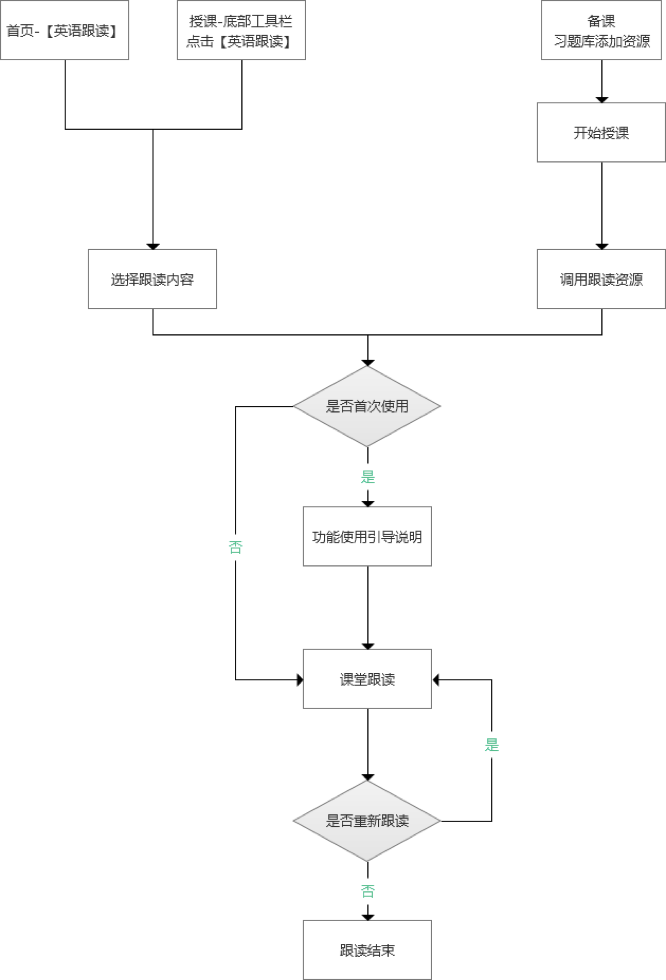
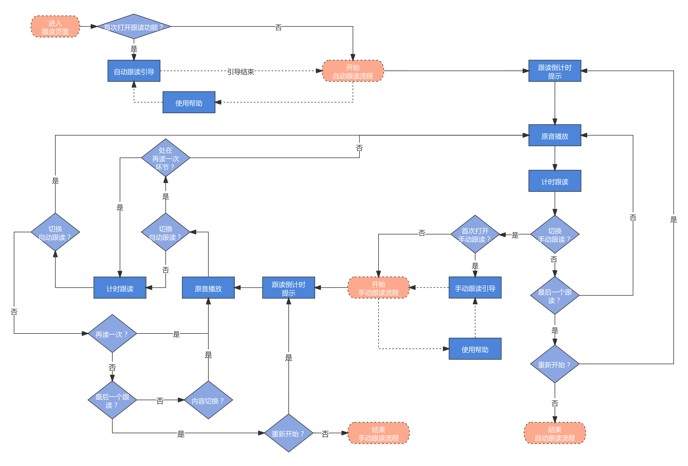
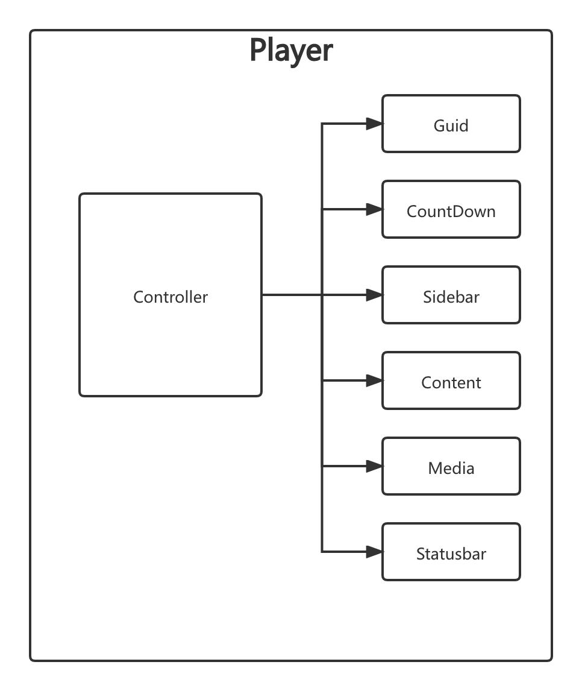
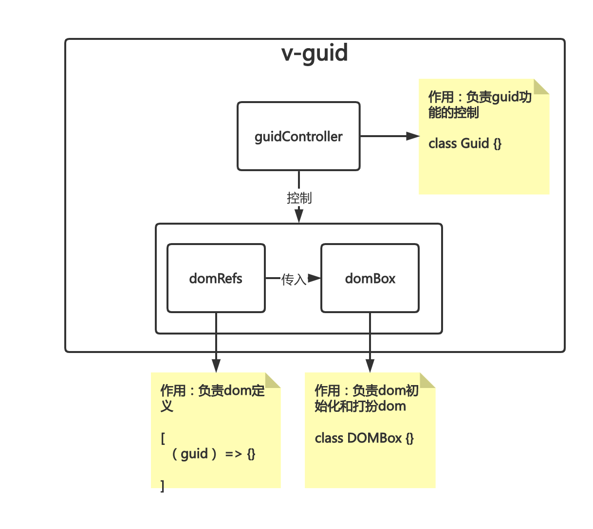

## 一、需求相关信息

### 1. 参与人员

| **项目人员** |          |                |
| ------------ | -------- | -------------- |
| **姓名**     | **角色** | **职责**       |
| 韦洁莹       | 产品     | 产品策划       |
| 郭锐杭       | 产品     | 产品策划       |
| 田楠         | UE       | UE设计         |
| 张沙沙       | UI       | UI设计         |
| 王君锷       | 开发     | 本地客户端开发 |
| 李嘉聪       | 开发     | 服务端开发     |
| 陈佳良       | 开发     | 前端开发       |
| 刘畅         | 测试     | 客户端测试     |
| 张苏兰       | 测试     | 客户端测试     |

### 2. 需求背景

接入英语跟读，可以让教师在课前、课中、课后让学生进行英语单词或文章的跟读，巩固基础教学内容。

### 3. 需求流程

## 二、方案调研
**用户引导功能**：初期备选方案是intro.js和driver.js两个有名的库。调研过程中发现intro.js如需商用，需要购买商用许可证，考虑到后期软著申请不知道会不会被查出来，放弃intro.js实现方案。driver.js是第二考虑方案，这个库调研发现属于一个个人的开源项目，虽然在github star数很多，但是当我在issue区域浏览的时候，发现有大量的issue是没有结局的，坑特别多，于是放弃方案2，思考新方案。观察了两个引导库的代码使用方式和实现的效果之后，觉得自己造轮子实现即使没写测试用例，这种功能的实现也不会太多坑。同时由于这个功能本身跟跟读流程的具体player组件是松耦合的，于是综合考虑之后，我选择了一个新方案：设计一个指令v-guid，只需要`<player v-guid></player>`就可以使用起来，何乐不为？

## 三、具体方案

### 1. 功能流程

### 2. 功能结构

### 3. v-guid指令设计思路
v-guid指令写过两个版本，如果说第一个版本是完全面向过程的实现，那么第二个版本就是面向对象的实现。这里，只选择第二个版本的实现来说明设计思路。首先看下指令结构图：

我在设计的过程当中选择将guid指令分成三部分：
**指令总控制器**是Guid这个类本身的实例，它的主要作用就是负责初始化指导功能和跳步骤。
**DOMBox**这个类的实例负责装创建出来的dom和控制对dom的部分行为，因此我把它取名叫做DOM盒子，就像一个小工具箱一样，它可以帮你创建出直接具有一定样式的dom，同时还可以对你想要装扮的dom进行打扮(dressup)，其实就是设置样式而已。在第一版实现当中，我设计了setMask，setPopOver等方法对dom的操控，但其实仔细想想，我个人觉得这些行为本身应该属于我要创造的这些dom自身的行为，而不是一种跟dom分隔开来的行为，它们应该属于各自dom的方法，在init初始化的时候进行的。于是再三思考下，我将每个dom需要初始化进行一些工作的事，都封装在了他们各自的init方法之下，当初始化domBox的时候，就可以对相应的dom进行init初始化了，相关组件之间的耦合性降低了。
**domDefs**是一个数组，数组的每一项被设计成了函数。每一个函数都会接收一个guid参数，这个guid参数就是当前的Guid实例，这么设计的原因是可能需要在函数里头获取guid的相关属性和其他额外的比如guidSteps指引步骤等。

## 四、其他