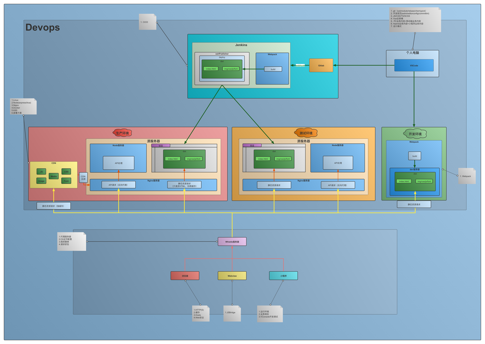

## 总览
`student-pc-competition`是pc端竞赛平台，跟`competition-app`一样，都是为了给学生参与竞赛作答使用的平台。流程依旧是翼赛后台管理系统去布置竞赛，然后让学生到pc平台去参与竞赛。
## 一、项目概述

- 开发模式：前后端分离
- 主要技术：handlebars+Js+Jquery+Scss+Webpack
- 仓库地址：`https://gitlab.ekwing.com/gz-server/student-pc-competition`

## 二、常见问题

- 这个项目的技术体系如何对标以Vue为基础环境的项目？
  由于这个项目一开始是从后端仓库拆分出来的，所以在技术体系上可能没有那么先进而是采用了一种叫做`handlebars`的模板引擎作为`DOM`模板，然后使用`Jquery`人为操作`DOM`的方式去把控项目的基础骨架和交互的。其他的诸如`Scss`和`Webpack`老生常谈了，只要是web技术基本上都离不开CSS预编译和打包构建的。
  那么我们该如何去理解这个项目呢？你可以把`handlebars`去当作`Vue Template`，就好像你在`SFC`或者说单文件组件中(也就是`xx.vue`)这种里头的`<template></template>`中书写各种标签一样。
  而`xxx.js`，只不过是相当于`xxx.vue`中的``里头写相关操作一样。不同的是,这个项目使用`jquery`手动操作`DOM`进一步地对指定的`DOM`结点进行交互操控的。而`Vue`属于一种`MVVM`框架，在使用上是属于数据驱动方式的，也就是说不需要你手动去操作`DOM`了，你告诉我数据就好了，这些都会由`VM`层去做处理。`VM`就是`view model`的缩写，你只需要把`VM`理解成你的仆人就好，你只需要告诉仆人数据，她会帮你把数据放到指定位置的（以前是你需要用`jquery`去使用`document.getElementById()`这种人为获取`DOM`操作`DOM`的方式来完成）。

- 这个项目本地如何调试呢？
  当你跃跃欲试打开项目的dev环境的时候，你会发现界面会出现一些类似于`{## ##}`的语法。请不要觉得奇怪，这时候请你去切换成prod环境，在项目控制台下输入`yarn build`，然后等待`dist`出现，打开`dist`好好看看底下随便一个`xx.html`，你就会发现其实这个项目的`html`最终产物不是我们熟悉的`html`，它长得很像而已。其实这是一种`PHP`模板引擎，叫做`smarty`模板。因此你看到类似于`<link href="{##race_resource_url##}competition/img/logo-yisai.d569b0e.png" rel="icon">`这样的语法心里不要产生排斥，很多项目都是历史的产物，你作为工程师，需要做的就是想办法让它跑起来。
  那么如何让自己的项目跑起来呢？推荐的方式是你自己在本地配置一个后端环境，毕竟`smarty`需要后端解决，那么就布置一个后端环境起来就好了。你只需要将`https://gitlab.ekwing.com/gz-server/raceapp-docker/tree/master`docker项目拉取下来，在本地下载docker，并使用`docker-compose`将所有服务跑起来就好了。随后需要配置的就是`whistle`环境，让你的服务转发到由`docker`启动起来的本地后端服务器中，`smarty`模板就能够解析了。当然要访问相关服务，你肯定是需要本地构建打包后，将你的构建产物`dist`放到后端项目的指定目录下面的。毕竟你要告诉后端服务器解析什么文件才是。事实上，你做的这些过程就是一个经典的部署流程，只不过后端服务器被放在了本地而已，你仔细思考下这个过程就可以理解了。