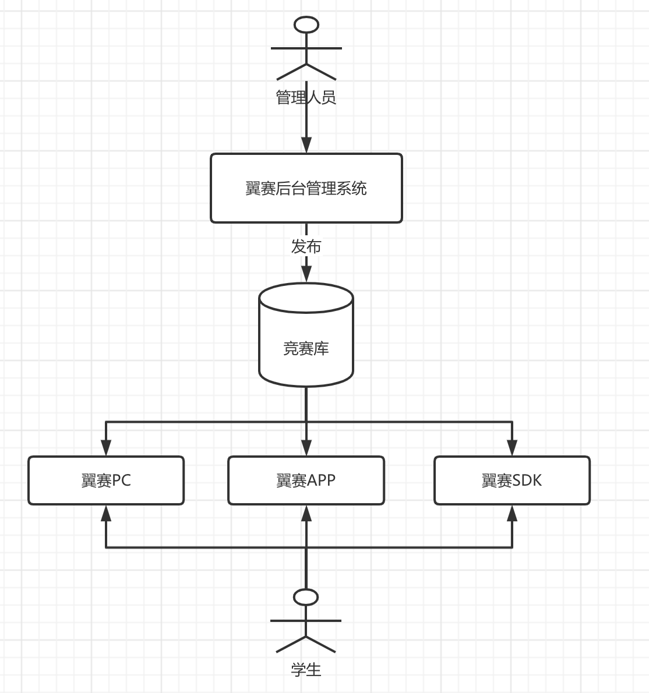

## 概述

翼赛这条业务线主要是为了给学生提供竞赛使用的，其中整个系统大体包括了翼赛PC/翼赛APP/翼赛SDK/翼赛ADMIN几个组成部分。

## 项目联系

从产品的使用来看，**翼赛ADMIN**也就是翼赛后台管理系统负责考试/竞赛的管理，一场考试或者竞赛总是需要有管理人员去布置的，比如说：布置一场考试/竞赛的时间，竞赛的内容，竞赛的范围等，这些都是由管理人员在翼赛后台当中进行布置的。当管理人员布置好竞赛之后，那么全国各个地方参与该竞赛的学生就可以入场参加比赛了。

那么如何参加各种比赛呢？于是我们有以下的方式去参加比赛。通过**翼赛PC**这个项目，我们可以让学生在电脑上参加比赛。当然为了给学生提供更多选择，我们也有**翼赛APP**给学生参加比赛。同时，在后边我们为了提供了一个赛前模拟，赛时入场比赛的入口，就是**翼赛SDK**。

对于**翼赛PC**和**翼赛APP**和**翼赛SDK**在我理解上来说只不过是相同的资料数据在不同端做出的展示而已。所以，你可以直接理解成：在**翼赛ADMIN**中布置竞赛，分发到数据系统当中后，再在**翼赛PC**和**翼赛APP**以及**翼赛SDK**当中拉取数据系统中的相关数据下来提供给学生竞赛。
