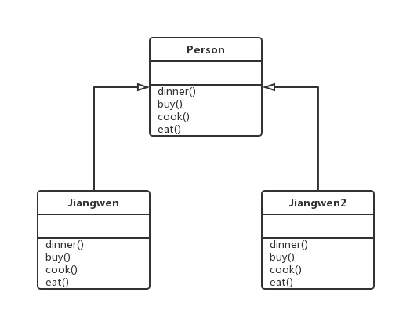

# 模板方法模式

模板方法模式在一个方法中定义一个算法的骨架，而将一些步骤的实现延迟到子类中。
模板方法使得子类可以在不改变算法结构的情况下，重新定义算法中某些步骤的具体实现。
一般有两部分组成，第一部分是抽象父类，第二部分是具体的实现子类。
好莱坞原则，子类放弃了控制权，改由父类来调用。

- 发布订阅
- 回调函数

模板方法模式强调算法流程固定不变，定义一条线（算法流程），线上的多个点是可以变化的（具体实现在子类中完成），线上的多个点一定是会被执行的，并且一定是按照特定流程被执行的。

## 类图

## 代码

## 场景
