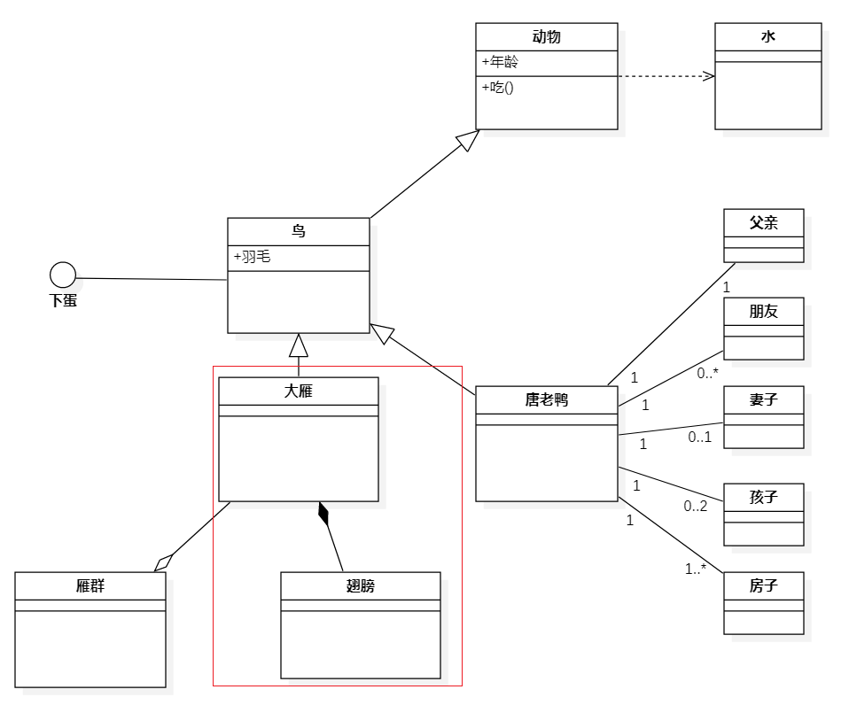

# 类图



描述类的静态结构，定义类及描述类之间的关系。

## 类的组成

UML中，类用矩形来表示。分成三部分，分别是名称、属性、操作。

## 类之间的联系

```js
Dependency:依赖（-->）
Association:关联（——）
Generalization:泛化 （——▷）
Realization:实现（--▷）
Aggregation:聚合（——◇）
Composition:组合（——◆）
```

多个类之间或多或少有一定的联系，这些联系在类图上的表示是连线+箭头。

- 依赖关系(Dependency)：只要在类中用到了对方，那么他们之间就存在依赖关系。B类实例的属性是A类实例：动物--->水（虚线+箭头）
  - 如果是类的成员属性
  - 如果是方法接收的参数类型
  - 如果是方法返回的返回类型
  - 如果是方法中用到了
  
- 泛化关系(Generalization)：B类继承A类： 鸟——▷动物（实线+白三角）
  - 泛化关系就是继承关系
  - 依赖关系的特例
  
- 实现关系(Implementation)：B类实现A接口：鸟---▷下蛋（虚线+白三角）
  - 依赖关系的特例
  
- 关联关系(Association)：B类跟A类的对应关系：

      ```js
            唐老鸭1——1唐老爸
            唐老鸭1——0..*唐老鸭的朋友
            唐老鸭1——0,1唐老鸭的妻子
      ```
  - 关联关系实际就是类和类之间的联系
  - 依赖关系的特例
  
- 聚合关系(Aggregation)：整体和部分的关系，部分可以离开整体： 大雁——◇雁群（实线+白菱形）
  - 关联关系的特例
  
- 组合关系(Composition)：整体和部分的关系，部分没法离开整体： 大雁的脚——◆大雁 （实线+黑菱形）
  - 关联关系的特例

- 总结：总体看只有一种依赖关系，从依赖关系细分出泛化关系，实现关系，关联关系。其中关联关系再细分出了聚合关系和组合关系。
