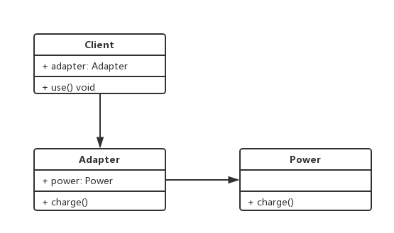

# 适配器模式

## 概述

将一个类的接口转换成客户端希望使用的另一个接口，使得原本因为接口不兼容而没法一起工作的类能够一起工作了。

适配器模式分为类适配器模式和对象适配器模式。类适配器模式的耦合度比较高，要求程序员必须了解现有组件内部的结构，应用较少。常用的是对象适配器模式。

## 结构

适配器模式包含以下角色：

- 目标接口：一个抽象类或者接口，用来定义客户端使用的接口
- 适配者类：被适配的类，当前已经存在的但是不符合客户端使用要求的类，需要被适配器适配转换的类
- 适配器类：转换器，通过继承或者引用适配者，把适配者的接口转换成符合客户端使用要求的接口

## 类图

## 代码

## 场景

- axios adapter
- promisify
- jquery
- vue computed
